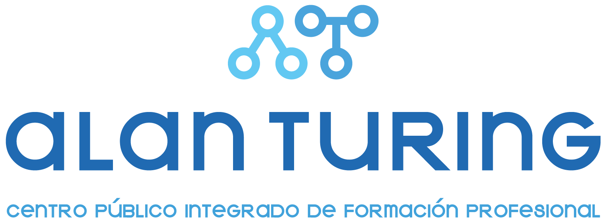

# LatencyZero

**LatencyZero** es una plataforma web innovadora y robusta diseñada para facilitar el acceso al conocimiento tecnológico relacionado con el montaje, la configuración y la compatibilidad de componentes informáticos. Su principal propósito es proporcionar las herramientas necesarias para que cualquier usuario desde principiantes hasta entusiastas experimentados pueda aprender, tomar decisiones fundamentadas y construir o mejorar su equipo informático de una manera sencilla, intuitiva y segura.

Nuestra plataforma integra un potente **agente inteligente** alimentado por Inteligencia Artificial, que trabaja en conjunto con diversas herramientas interactivas y modelos de visión artificial, diseñadas para guiar al usuario en cada etapa del proceso de selección, análisis de compatibilidad y comparación de componentes hardware.

👉 Más información en la **[Wiki del proyecto](https://github.com/Latency-Zero-tfm/LatencyZero/wiki)**.

🌐 Puedes acceder a la aplicación web en: https://latencyzero.vercel.app/

**TFM del Máster de FP en Inteligencia Artificial y Big Data - CPIFP Alan Turing**

## 🖥️ HardVisionAI

**HardVisionAI** es un modelo avanzado de visión artificial que ha sido entrenado y optimizado en nuestro ecosistema para identificar, clasificar y extraer información automáticamente de diversos componentes de ordenador mediante el análisis de imágenes. Es capaz de deducir datos técnicos cruciales como la marca, el modelo y sus especificaciones clave.

Dentro de LatencyZero, HardVisionAI cumple una función dual: por un lado, asiste y alimenta de información técnica al Agente Inteligente, y por otro, ofrece funcionalidades integradas directamente en la interfaz de la aplicación para el análisis de componentes por parte del usuario.

Originalmente, el modelo y su correspondiente demostración fueron conceptualizados y desarrollados en un repositorio paralelo de fase temprana. Con el objetivo de facilitar su prueba por parte de cualquier persona, hemos desplegado una versión interactiva mediante **Streamlit**, la cual permite visualizar y entender el potencial de HardVisionAI de forma clara e intuitiva. Es una versión no definitiva, pero que muestra el potencial del modelo y su utilidad para el proyecto.

## 👤 Créditos

### 👨‍💻 Autores del proyecto

* [Alejandro Barrionuevo Rosado](https://github.com/Alejandro-BR)
* [Alvaro López Guerrero](https://github.com/Alvalogue72)
* [Andrei Munteanu Popa](https://github.com/andu8705)

🎓 Repositorio del centro educativo: [iabd-tfm-2526](https://github.com/CPIFPAlanTuring/iabd-tfm-2526)

Máster de FP en Inteligencia Artifical y Big Data - CPIFP Alan Turing

 `Curso 2025/2026`

### 📄 Licencia

Este proyecto y todo su código asociado están protegidos por derechos de autor. No se permite su uso, copia, modificación, distribución ni la creación de obras derivadas sin la autorización expresa y por escrito de los autores mencionados.

© 2026 Alejandro-BR, Alvalogue72, andu8705. Todos los derechos reservados.  
Para cualquier tipo de consulta comercial, colaboraciones o permisos especiales, por favor contactar a través de: [latencyzero.tfm@gmail.com](mailto:latencyzero.tfm@gmail.com)

---

⭐ Si este proyecto te ha resultado interesante o útil, ¡te agradeceríamos que nos apoyaras dándole una estrella en GitHub! 😉

