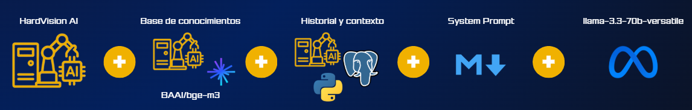
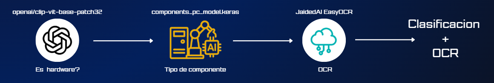

# 🌐 LatencyZero Server

Backend central desarrollado con el framework **FastAPI** diseñado para exponer los servicios de Machine Learning, la gestión de agentes basados en LLM, y todas las operativas lógicas del ecosistema **LatencyZero**.


## 🤖 Agente de IA y Proceso en Segundo Plano

El componente central de inteligencia de LatencyZero está impulsado por un agente de IA que combina múltiples tecnologías para ofrecer una asistencia altamente contextualizada y precisa. El siguiente esquema ilustra su proceso en segundo plano:



### Explicación Paso a Paso del Flujo del Agente:

1. **HardVision AI:** Cuando un usuario proporciona una imagen (o si se invoca desde la interfaz), este módulo actúa como el analizador visual inicial, identificando el componente y extrayendo metadatos esenciales y de texto, sirviendo como punto de entrada de información rica y estructurada.

2. **Base de Conocimientos (Embeddings BAAI/bge-m3):** El input textual o el resultante de HardVision AI se cruza con nuestra inmensa base de conocimientos. Para esto, utilizamos el modelo de embeddings `BAAI/bge-m3` que permite transformar el texto en vectores y realizar búsquedas de similitud precisas en Zilliz Cloud (Milvus) a través de una arquitectura RAG (*Retrieval-Augmented Generation*).

3. **Historial y Contexto (Python + PostgreSQL):** El proceso no solo evalúa el momento presente, sino que también recupera el historial de la conversación y las preferencias almacenadas, gestionado y estructurado a través de lógica en Python y una base de datos relacional robusta en PostgreSQL, asegurando una interacción continua y coherente.

4. **System Prompt (Módulo de Comportamiento):** Se inyecta un set de reglas precisas y de contexto adicional (*System Prompt*) configurado en `system_prompt.md`, que establece el tono, las fronteras éticas, y el formato que el agente debe respetar al responder.

5. **Generación (llama-3.3-70b-versatile de Meta):** Finalmente, toda esta amalgama de información estructurada, contexto histórico, reglas del sistema y contexto recuperado vectorialmente es enviada al potente LLM `Llama-3.3-70b-versatile` de Meta (usando la API de Groq), responsable de generar la respuesta inteligente final, humana y altamente precisa que recibe el usuario.

## 👁️‍🗨️ HardVisionAI: Pipeline de Visión Artificial

Para clasificar componentes desde una imagen, hemos desarrollado una tubería (pipeline) de procesamiento con las siguientes etapas:



### Explicación Paso a Paso del Flujo de HardVisionAI:

1. **Filtro de Relevancia (openai/clip-vit-base-patch32):** El primer paso es determinar: *¿Es esta imagen realmente un componente de hardware?* Para evitar que el sistema procese imágenes irrelevantes (ej. mascotas, comida), el modelo preentrenado CLIP de OpenAI evalúa la imagen y descarta las que no encajen con las categorías predefinidas de componentes o que contengan ruido.

2. **Clasificación (components_pc_model.keras):** Una vez validada, la imagen pasa por nuestro modelo convolucional propio (`components_pc_model.keras`), entrenado para distinguir con precisión entre diferentes categorías de componentes de PC (como Placa Base, GPU, CPU, etc.).

3. **Reconocimiento de Texto (JaidedAI EasyOCR):** En paralelo, la imagen se escanea en busca de texto visible (marcas, modelos, números de serie, capacidades) usando la biblioteca `EasyOCR`.

4. **Resultado (Clasificación + OCR):** El resultado final combina la etiqueta de clasificación principal generada por el modelo Keras, junto con todos los metadatos de texto extraídos por el OCR, devolviendo una estructura rica en datos (*ComponentDTO*) que se puede utilizar tanto en la interfaz del usuario como para dar contexto directo al Agente de IA.


## 📌 Diagrama Entidad-Relación

La estructura subyacente de la base de datos relacional de LatencyZero se representa a continuación:


## 🧪 Instalación y Ejecución del Backend

Sigue estos pasos para levantar el servidor en tu entorno de desarrollo local.

> [!IMPORTANT]
> Es estrictamente necesario tener instalado **Python 3.12** para asegurar que todas las dependencias (como `easyocr` y `tensorflow`) y la ejecución del backend funcionen de manera óptima.

Puedes comprobar la versión que tienes instalada en tu sistema con el siguiente comando:

```bash
python --version
```

### 1️⃣ Entrar al directorio del proyecto

```bash
cd backend
```

### 2️⃣ Configuración del entorno (`.env`)

En la raíz del directorio `backend/`, crea un archivo llamado `.env` y define las siguientes variables:

```env
# Configuración del entorno
ENV=development

# Conexión a Base de datos
DATABASE_URL=

# Configuración de Seguridad y JWT
SECRET_KEY=

# Políticas de CORS
CORS_ORIGINS=

# API para el Agente LLM
GROQ_API_KEY=

# Token para HuggingFace
HF_TOKEN=

# Token y conexion a Base de datos Vectorial
ZILLIZ_URI=
ZILLIZ_TOKEN=
```

⚠️ Asegúrate de rellenar todas las credenciales antes de continuar.

### 3️⃣ Crear el entorno virtual

Es recomendable aislar las dependencias creando un entorno virtual:

```bash
python -m venv venv
```

### 4️⃣ Activar el entorno virtual

#### 🪟 Windows

```bash
venv\Scripts\activate
```

#### 🐧 Linux / 🍎 macOS

```bash
source venv/bin/activate
```

### 5️⃣ Instalar dependencias

Con el entorno virtual activado, procede a instalar las bibliotecas necesarias:

```bash
pip install -r requirements.txt
```

> **Nota de Requisitos:** En el archivo `requirements.txt` y en las importaciones, podrías encontrar listadas herramientas y librerías, sin embargo, todas las incluidas son esenciales para el funcionamiento de los servicios (FastAPI, Langchain, modelos de ML como Keras/Tensorflow, y servicios como PyMilvus). Cada módulo contribuye directa o indirectamente (como utilidades de formato o parsing) a la lógica de la aplicación.

### 6️⃣ Ejecutar el servidor

Levanta el servidor en modo *reload* para desarrollo:

```bash
uvicorn latencyzero_server.main:app --reload
```

### 7️⃣ Acceso y Documentación

Una vez el servidor esté funcionando, tendrás acceso a los siguientes endpoints locales:

* 🌍 **API Raíz**
  👉 [http://127.0.0.1:8000](http://127.0.0.1:8000)

* 📚 **Documentación Interactiva (Swagger UI)**
  👉 [http://127.0.0.1:8000/docs](http://127.0.0.1:8000/docs)
  *(Interfaz perfecta para testear los endpoints y la operativa visualmente)*
