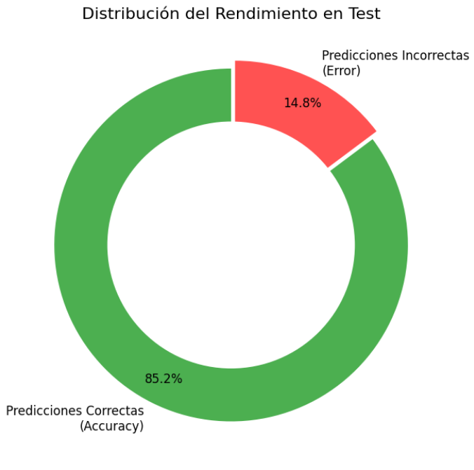

# 📊 Modelos

Resumen de los modelos entrenados por nosotros y utilizados en el proyecto.

## 📷 Components PC Model

`components_pc_model.keras`

La arquitectura del modelo se basa en una **Red Neuronal Convolucional (CNN)** construida con **Keras**, que incluye múltiples capas de convolución, normalización, pooling y capas densas, finalizando con una capa **softmax** para clasificación multiclase. 

| 🧩 Layer (type)                           | Output Shape         | Param # |
| ----------------------------------------- | -------------------- | ------- |
| 🟦 **conv2d_20 (Conv2D)**                 | (None, 230, 230, 16) | 160     |
| 🟪 **batch_normalization_10 (BatchNorm)** | (None, 230, 230, 16) | 64      |
| 🟩 **max_pooling2d_25 (MaxPooling2D)**    | (None, 115, 115, 16) | 0       |
| 🟦 **conv2d_21 (Conv2D)**                 | (None, 115, 115, 32) | 4,640   |
| 🟪 **batch_normalization_11 (BatchNorm)** | (None, 115, 115, 32) | 128     |
| 🟩 **max_pooling2d_26 (MaxPooling2D)**    | (None, 57, 57, 32)   | 0       |
| 🟦 **conv2d_22 (Conv2D)**                 | (None, 57, 57, 64)   | 18,496  |
| 🟪 **batch_normalization_12 (BatchNorm)** | (None, 57, 57, 64)   | 256     |
| 🟩 **max_pooling2d_27 (MaxPooling2D)**    | (None, 28, 28, 64)   | 0       |
| 🟨 **global_average_pooling2d (GAP)**     | (None, 64)           | 0       |
| 🔴 **dropout_16 (Dropout)**               | (None, 64)           | 0       |
| 🟧 **dense_24 (Dense)**                   | (None, 64)           | 4,160   |
| 🔴 **dropout_17 (Dropout)**               | (None, 64)           | 0       |
| 🟧 **dense_25 (Dense)**                   | (None, 11)           | 715     |

- **📝 Total params:** 28,619 (≈111.79 KB)
- **⚡ Trainable params:** 28,395 (≈110.92 KB)
- **❌ Non-trainable params:** 224 (≈896 B)


### 🏷️ Clasificacion

```python
label_map = {
    0: 'motherboard',
    1: 'gpu',
    2: 'cpu',
    3: 'hard_drive',
    4: 'ram',
    5: 'pc_case',
    6: 'power_supply',
    7: 'liquid_cooling',
    8: 'case_fan',
    9: 'cpu_fan',
    10: 'sound_card'
}
```

### Resultados de rendimiento



#### Evolución del Entrenamiento

El modelo se entrenó durante **18 épocas** antes de que el *Early Stopping* detuviera el proceso para evitar el sobreajuste.

* **Punto de inflexión:** Al inicio (Época 1), el modelo apenas tenía una precisión del **35%**. Sin embargo, se observa una mejora drástica en la **Época 9**, coincidiendo con la primera reducción automática de la tasa de aprendizaje (*Learning Rate*).

**Métricas Finales:**
* **Precisión de entrenamiento:** ~82.5%
* **Precisión de validación:** **86.6%**
* **Pérdida (Loss) de validación:** 0.5061


#### Evaluación con Datos de Prueba (Test)

Al evaluar el modelo con el conjunto de datos de prueba (`x_test`), los resultados confirman su solidez:

* **Precisión en Test (Accuracy):** **85.24%**
* **Pérdida en Test:** 0.5073
* **Interpretación:** Una precisión del 85% en un problema de 11 categorías.

#### Análisis de General

* **Eficacia del Optimizador:** El uso de `ReduceLROnPlateau` permitió que, cuando el modelo dejó de mejorar con la tasa de aprendizaje inicial, se realizaran ajustes más finos (bajando de  a  y finalmente a ), lo que permitió "pulir" la precisión en las últimas etapas.

* **Robustez:** El modelo es capaz de manejar la descompensación en el dataset (donde algunas categorías tenían muy pocas imágenes, como las tarjetas de sonido) sin perder eficacia global.
* **Eficiencia:** Al procesar las imágenes en **escala de grises**, el modelo logra estos resultados con una arquitectura eficiente de 3 capas convolucionales, lo que permite predicciones rápidas incluso en hardware no especializado.