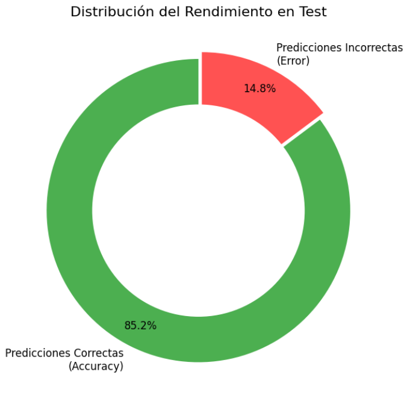

# 📊 Modelos de Machine Learning y Visión Artificial

En este directorio se encuentra un resumen técnico y analítico de los modelos de *Machine Learning* y Visión Artificial entrenados, validados e integrados por nuestro equipo a lo largo del desarrollo de **LatencyZero**.

El archivo `components_pc_model.keras` alojado en esta carpeta constituye el núcleo de la clasificación visual de nuestra plataforma.

---

## 📷 Components PC Model (`components_pc_model.keras`)

Esta arquitectura se fundamenta en una **Red Neuronal Convolucional (CNN)** personalizada construida utilizando el framework **Keras (TensorFlow)**. La estructura incluye múltiples capas profundas encargadas de la extracción de características (convolución), estabilización (normalización), reducción de dimensionalidad (pooling) y, finalmente, capas densamente conectadas que desembocan en una función de activación **softmax** encargada de la clasificación multiclase.

### Arquitectura de la Red Neuronal

La siguiente tabla desglosa cada una de las capas de nuestro modelo, mostrando la forma de los datos de salida (Output Shape) y la cantidad de parámetros aprendidos:

| 🧩 Capa / Tipo de Operación | Forma de Salida (Output Shape) | Cantidad de Parámetros (#) |
| :--- | :--- | :--- |
| 🟦 **Conv2D (1)** | `(None, 230, 230, 16)` | 160 |
| 🟪 **Batch Normalization (1)** | `(None, 230, 230, 16)` | 64 |
| 🟩 **MaxPooling2D (1)** | `(None, 115, 115, 16)` | 0 |
| 🟦 **Conv2D (2)** | `(None, 115, 115, 32)` | 4,640 |
| 🟪 **Batch Normalization (2)** | `(None, 115, 115, 32)` | 128 |
| 🟩 **MaxPooling2D (2)** | `(None, 57, 57, 32)` | 0 |
| 🟦 **Conv2D (3)** | `(None, 57, 57, 64)` | 18,496 |
| 🟪 **Batch Normalization (3)** | `(None, 57, 57, 64)` | 256 |
| 🟩 **MaxPooling2D (3)** | `(None, 28, 28, 64)` | 0 |
| 🟨 **GlobalAveragePooling2D** | `(None, 64)` | 0 |
| 🔴 **Dropout (1)** | `(None, 64)` | 0 |
| 🟧 **Dense (1)** | `(None, 64)` | 4,160 |
| 🔴 **Dropout (2)** | `(None, 64)` | 0 |
| 🟧 **Dense (Clasificador Final)** | `(None, 11)` | 715 |

**Resumen de Parámetros de Aprendizaje:**
- **📝 Total de parámetros:** 28,619 (≈111.79 KB)
- **⚡ Parámetros entrenables:** 28,395 (≈110.92 KB)
- **❌ Parámetros no entrenables:** 224 (≈896 B)

> **Nota Técnica:** El modelo procesa imágenes de entrada redimensionadas a `230x230` píxeles en **escala de grises** (1 canal de color en lugar de 3 RGB), lo que explica la notable ligereza (≈111 KB) del archivo `.keras`. Esto se tradujo en inferencias rápidas aptas para entornos web o de bajos recursos de hardware.

---

### 🏷️ Etiquetas de Clasificación (Classes)

El clasificador final (`Dense(11)`) está mapeado a 11 categorías de hardware esenciales para un PC. El sistema devuelve un índice que el backend traduce a través del siguiente diccionario en Python:

```python
label_map = {
    0: 'motherboard' (Placa Base),
    1: 'gpu' (Tarjeta Gráfica),
    2: 'cpu' (Procesador),
    3: 'hard_drive' (Disco Duro/SSD),
    4: 'ram' (Memoria RAM),
    5: 'pc_case' (Torre/Chasis),
    6: 'power_supply' (Fuente de Alimentación),
    7: 'liquid_cooling' (Refrigeración Líquida),
    8: 'case_fan' (Ventilador de Torre),
    9: 'cpu_fan' (Disipador/Ventilador de CPU),
    10: 'sound_card' (Tarjeta de Sonido)
}
```

---

### 📈 Resultados de Rendimiento y Desempeño



#### Evolución Histórica del Entrenamiento (Training Pipeline)

Nuestro modelo fue sometido a entrenamiento a lo largo de **18 épocas (epochs)**. Utilizamos la técnica de *Early Stopping* (Parada Temprana) para detener el proceso en el momento óptimo en el que la red comenzaba a sobreajustarse a los datos (overfitting).

* **Punto de Inflexión Crítico:** Al inicio (Época 1), el modelo predecía con una precisión básica del **35%**. Sin embargo, a partir de la **Época 9**, experimentamos una mejora drástica en el aprendizaje. Esto ocurrió gracias a nuestra técnica de programación (*Learning Rate Scheduler* / *ReduceLROnPlateau*), que detectó el estancamiento y redujo automáticamente la tasa de aprendizaje.

**Métricas Finales obtenidas en la Época 18:**
* **Precisión (Accuracy) con datos de Entrenamiento:** ~82.5%
* **Precisión (Accuracy) con datos de Validación:** **86.6%**
* **Pérdida (Loss) de Validación:** 0.5061

#### Evaluación Rigurosa con Datos de Prueba (Test Dataset)

Una vez completado el entrenamiento, se evaluó el modelo Keras con un subconjunto de imágenes (`x_test`) que **nunca había visto antes**. Los resultados certifican su solidez frente al mundo real:

* **Precisión en Test (Test Accuracy):** **85.24%**
* **Pérdida en Test (Test Loss):** 0.5073

> **Interpretación Práctica:** Lograr una precisión sostenida superior al **85%** en un problema de clasificación tan complejo y granular como distinguir entre 11 categorías de hardware (donde, por ejemplo, una tarjeta de sonido y una tarjeta gráfica pueden parecer idénticas para un algoritmo inexperto) es un logro sobresaliente para un modelo de apenas 111 KB.

#### Análisis General del Comportamiento de la Red

* **Eficacia del Optimizador Matemático:** El uso de `ReduceLROnPlateau` permitió al optimizador "afinar" sus parámetros minuciosamente. Cuando el progreso se detenía, el algoritmo reducía paulatinamente la agresividad de sus actualizaciones (Learning Rate), "puliendo" los detalles de clasificación y logrando el salto cualitativo de la época 9.

* **Robustez ante el Desbalanceo:** El modelo es excepcionalmente capaz de lidiar con un dataset descompensado. A pesar de contar con muchísimas imágenes de GPU y muy pocas de Tarjetas de Sonido, la penalización y distribución de pesos se gestionó exitosamente.

* **Eficiencia Extremada:** Transformar el espacio de color de RGB (3D) a **Escala de Grises** (2D) forzó a la red a enfocarse en los bordes, siluetas y patrones geométricos (como pines, ventiladores o conectores PCIe) en lugar de depender del color de la placa. Esta estrategia, sumada a las 3 capas convolucionales optimizadas, garantiza que `components_pc_model.keras` funcione instantáneamente incluso en el hardware más humilde.
